# ParsingIsAllYouNeed

## Identitas Kelompok
Kelompok : PIA - ParsingIsAllYouNeed
| No | NIM      | Nama Lengkap                  |
| -- | -------- | ----------------------------- |
| 1  | 13523021 | Muhammad Raihan Nazhim Oktana |
| 2  | 13523057 | Faqih Muhammad Syuhada        |
| 3  | 13523097 | Shanice Feodora Tjahjono      |
| 4  | 13523105 | Muhammad Fathur Rizky         |

## Deskripsi Program
Tugas Besar Teori Bahasa Formal dan Otomata (IF2224-24) Milestone 1 ini mengimplementasikan tahap pertama dari proses kompilasi, yaitu analisis leksikal (lexical analysis) pada bahasa pemrograman Pascal-S yang merupakan subset dari bahasa Pascal. Melalui pembangunan lexical analyzer (lexer) berbasis Deterministic Finite Automata (DFA), program mampu membaca kode sumber Pascal-S dan mengubahnya menjadi deretan token yang memiliki arti semantik, seperti keyword, identifier, operator, literal, dan simbol-simbol lainnya. Program ini dibuat dengan menggunakan bahasa Python dan hanya dapat berjalan pada CLI (Command Line Interface).

## Requirements
- Python Version 3.13.1 or newer
- uv Version 0.7.8 or newer

## Usage
```bash
uv sync

uv run src/main.py test/milestone-1/input/1.pas
```

Output example:
```bash
KEYWORD(program)
IDENTIFIER(Hello)
SEMICOLON(;)
```

### Check Mode
Compare lexer output with expected output:
```bash
uv run src/main.py test/milestone-1/input/1.pas --check
```

Output when passing:
```bash
[PASS] Output matches expected!
```

Output when failing:
```bash
[FAIL] Output differs from expected:

Expected:
----------------------------------------
KEYWORD(program)
IDENTIFIER(Test)
...

Actual:
----------------------------------------
KEYWORD(program)
IDENTIFIER(Hello)
...

Differences:
----------------------------------------
Line 2:
  Expected: IDENTIFIER(Test)
  Actual:   IDENTIFIER(Hello)
```

### Save Output to File
Save lexer output to a file:

**Auto-save to milestone output directory:**
```bash
# Automatically saves to test/milestone-1/output/1.txt
uv run python src/main.py test/milestone-1/input/1.pas --output
```

**Save to custom path:**
```bash
# Save to specific file
uv run python src/main.py test/milestone-1/input/1.pas --output my_output.txt
```

**Combine with check mode:**
```bash
# Check against expected output AND save to file
uv run python src/main.py test/milestone-1/input/1.pas --check --output
```



```mermaid
stateDiagram-v2
    %% === START STATE ===
    [*] --> S0

    %% === IDENTIFIER ===
    S0 --> ID: LETTER
    ID --> ID: LETTER
    ID --> ID: DIGIT

    %% === NUMBER / REAL ===
    S0 --> NUM: DIGIT
    NUM --> NUM: DIGIT
    NUM --> NUM_DOT: DOT_SYMBOL
    NUM_DOT --> NUM_REAL: DIGIT
    NUM_REAL --> NUM_REAL: DIGIT

    %% === WHITESPACE ===
    S0 --> WS: WS
    WS --> WS: WS

    %% === PUNCTUATION / DELIMITERS ===
    S0 --> SC: SEMICOLON
    S0 --> COM: COMMA
    S0 --> OPENP: LPAREN
    OPENP --> CMTP: ASTERISK
    S0 --> RP: RPAREN
    S0 --> LB: LBRACKET
    S0 --> RB: RBRACKET
    S0 --> DOT: DOT_SYMBOL
    DOT --> RANGE: DOT_SYMBOL
    S0 --> COL: COLON_SYMBOL
    COL --> ASSIGN: EQUALS

    %% === OPERATORS ===
    S0 --> PLUS: PLUS
    S0 --> MINUS: MINUS
    S0 --> MUL: ASTERISK
    S0 --> DIV: SLASH
    S0 --> EQ: EQUALS
    S0 --> LT: LESS_THAN
    LT --> LE: EQUALS
    LT --> NE: GREATER_THAN
    S0 --> GT: GREATER_THAN
    GT --> GE: EQUALS

    %% === STRING LITERAL ===
    S0 --> STR: QUOTE
    STR --> STR: NOT_QUOTE
    STR --> STR_END: QUOTE
    STR_END --> STR: QUOTE

    %% === COMMENTS ===
    %% Block comment: { ... }
    S0 --> CMTB: LBRACE
    CMTB --> CMTB: NOT_RBRACE
    CMTB --> CMTB_END: RBRACE

    %% Parenthesis comment: (* ... *)
    CMTP --> CMTP: ANY
    CMTP --> CMTP_STAR: ASTERISK
    CMTP_STAR --> CMTP_END: RPAREN
    CMTP_STAR --> CMTP_STAR: ASTERISK
    CMTP_STAR --> CMTP: ANY

    %% === KEYWORDS & RESERVED MAP (symbolic) ===
    state KW_ARITHOP
    state KW_LOGOP
    state KW

    ID --> KW_ARITHOP
    ID --> KW_LOGOP
    ID --> KW

    %% === NOTES / TOKEN TYPES ===
    note right of ID : IDENTIFIER
    note right of NUM : NUMBER
    note right of NUM_REAL : NUMBER
    note right of WS : WHITESPACE
    note right of SC : SEMICOLON
    note right of COM : COMMA
    note right of DOT : DOT
    note right of RANGE : RANGE_OPERATOR
    note right of OPENP : LPARENTHESIS
    note right of RP : RPARENTHESIS
    note right of LB : LBRACKET
    note right of RB : RBRACKET
    note right of COL : COLON
    note right of ASSIGN : ASSIGN_OPERATOR
    note right of PLUS : ARITHMETIC_OPERATOR
    note right of MINUS : ARITHMETIC_OPERATOR
    note right of MUL : ARITHMETIC_OPERATOR
    note right of DIV : ARITHMETIC_OPERATOR
    note right of EQ : RELATIONAL_OPERATOR
    note right of LT : RELATIONAL_OPERATOR
    note right of LE : RELATIONAL_OPERATOR
    note right of NE : RELATIONAL_OPERATOR
    note right of GT : RELATIONAL_OPERATOR
    note right of GE : RELATIONAL_OPERATOR
    note right of STR_END : STRING_LITERAL
    note right of CMTB_END : COMMENT
    note right of CMTP_END : COMMENT

    note right of KW_ARITHOP : ARITHMETIC_OPERATOR (div, mod)
    note right of KW_LOGOP : LOGICAL_OPERATOR (and, or, not)
    note right of KW : KEYWORD (program, var, begin, end, if, then, else, while, do, for, to, downto, integer, real, boolean, char, array, of, procedure, function, const, type)

    %% === VISUAL CLASSES ===
    classDef loop fill:#fff7ed,stroke:#f59e0b,stroke-width:2px,stroke-dasharray:3 2;
    class ID,NUM,NUM_REAL,WS,STR,CMTB,CMTP,CMTP_STAR loop;

    classDef accept fill:#d1fae5,stroke:#10b981,stroke-width:2px;
    class ID,NUM,NUM_REAL,WS,SC,COM,DOT,RANGE,OPENP,RP,LB,RB,COL,ASSIGN,PLUS,MINUS,MUL,DIV,EQ,LT,LE,NE,GT,GE,STR_END,CMTB_END,CMTP_END,KW,KW_LOGOP,KW_ARITHOP accept;
```

## Pembagian Tugas
| No | NIM      | Nama Lengkap                  | Persentase Pembagian Tugas |
| -- | -------- | ----------------------------- | -------------------------- |
| 1  | 13523021 | Muhammad Raihan Nazhim Oktana | 100%                       |
| 2  | 13523057 | Faqih Muhammad Syuhada        | 100%                       |
| 3  | 13523097 | Shanice Feodora Tjahjono      | 100%                       |
| 4  | 13523105 | Muhammad Fathur Rizky         | 100%                       |
